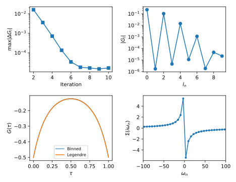

.. _dmft_framework:

DMFT self consistent framework
==============================

This is a small framework for doing self consistent DMFT calculations for the Hubbard model on the square lattice using the `triqs_cthyb` impurity solver. The framework is based on the `TPRF` helper class `ParameterCollection` that makes it easier to keep the results of a calculation in a single object that can be stored and passed as argument.

A script performing a self consisten calculation using the framework takes the form

.. literalinclude:: calc_sc.py
   :lines: 23-

where the framework is used to setup the calcuation by calling the function `setup_dmft_calculation` and the self consistent solution i obtained by calling `solve_self_consistent_dmft`. For details on these function please se next section.

The result is the self consistent DMFT solution of the system, plotted below.

The visulaization script is available here: :download:`plot_sc.py <plot_sc.py>`.
	   
Implementation details
----------------------
	   
The above script uses the `common.py` python module, available for download here: :download:`common.py <common.py>`. This section goes through the details of the routines in the module.

The `common.py` module includes ther modules from `TRIQS`, `triqs_cthyb`, and `TPRF`, etc..

.. literalinclude:: common.py
   :lines: 23-36		

Setup DMFT Calculation
^^^^^^^^^^^^^^^^^^^^^^

The function `setup_dmft_calculation` takes a `ParameterCollection` as input and constructs

- the local interaction :math:`H_{\textrm{int}} = Un_\uparrow n_\downarrow - \frac{U}{2} (n_\uparrow + n_\downarrow)` in `p.solve.h_int`,
- the lattice dispersion :math:`\epsilon_{\mathbf{k}}` in `p.e_k`, and
- the initial (zero) guess for the self-energy :math:`\Sigma` in `p.sigma_w`.
	   
.. literalinclude:: common.py
   :lines: 38-62		

Solve Self-Consistent DMFT
^^^^^^^^^^^^^^^^^^^^^^^^^^

The function `solve_self_consistent_dmft` repeatedly runs the DMFT self consistency step and looks for convergence in the local Legendre Green's function :math:`G_l`.
	   
.. literalinclude:: common.py
   :lines: 64-76		

DMFT Self-Consistent Step
^^^^^^^^^^^^^^^^^^^^^^^^^

The function `dmft_self_consistent_step` performs a complete DMFT step starting from the given self-energy :math:`\Sigma` it takes the steps,

- compute the lattice local Green's function :math:`g(i\omega_n)` in `p.g_w`
- compute the local Weiss field :math:`g_0(i\omega_n) = [ g^{-1} + \Sigma ]^{-1}` in `p.g0_w`
- setup the `triqs_cthyb` solver
- set the Weiss field of the solver in `cthyb.G0_iw` from the lattice `p.g0_w`.
- run the `triqs_cthyb` solver and sample the Legendre Green's function :math:`G_l` in `p.G_l`
- compute a new self energy :math:`\Sigma` from the sampled Greens function `p.G_l` and Weiss field `p.G0_w`
- set the lattice self energy `p.sigma_w` from the impurity self energy `p.Sigma_w`
  
.. literalinclude:: common.py
   :lines: 78-115		

