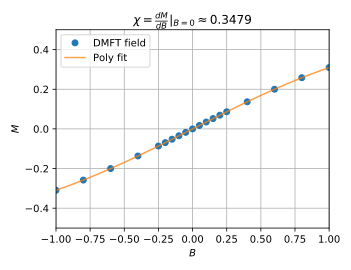
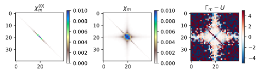
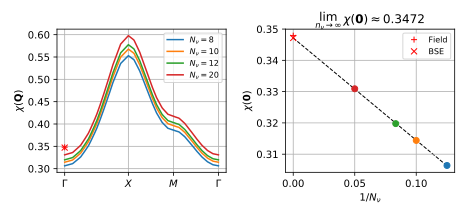

.. _dmft_susceptibility:

DMFT lattice susceptibility
===========================

In this guide we will compute the uniform magnetic susceptibility :math:`\chi = \chi(\mathbf{Q} = \mathbf{0})` of the single band Hubbard model on the square lattice with nearest neighbour hopping using dynamical mean-field theory (DMFT).

We will do this in two very different ways from

1. self consistent DMFT calculations in applied fields, and from
2. the lattice Bethe-Salpeter Equation using the DMFT local vertex.

Since DMFT is thermodynamically consistent *[Hafermann et al., PRB 90, 235105 (2014)]* these two approaches gives the same susceptibility within error-bars.

Self consistent calculations in applied field
---------------------------------------------

First we compute the uniform magnetic susceptibility :math:`\chi` by appyling an external magnetic field :math:`B` and measuring the resulting magnetization :math:`M`. The susceptibility :math:`\chi` is then given as the derivative at zero field, i.e.

.. math::
   \chi = \left. \frac{dM}{dB} \right|_{B \rightarrow 0} \, .

In practice this is done by performing a series of self-consistent DMFT calculations at finite fields :math:`B \ne 0`. To do this we will use a lightweight framework for doing self consistent DMFT calculations taylored to the Hubbard model on the square lattice, for details see :ref:`dmft_framework`.

The *framework* python module `common.py` is available here: :download:`common.py <common.py>`, and is based on the `TPRF` helper class `ParameterCollection` that makes it possible to store the results of a calculation in a single object that, in turn, can be stored and passed as argument.

To determine :math:`\chi` we perform a series of self consistent calculations for several values of the magnetic field :math:`B`. Using the DMFT framework this looks like

.. literalinclude:: calc_field.py
   :lines: 23-		

The result is a magnetization :math:`M` vs. applied magnetic field :math:`B` curve, to which we fit a low order polynomial, and compute its zero field derivative.

The visualization script is available here: :download:`plot_field.py <plot_field.py>`.

The resulting homogenous static spin susceptbility has the value

.. math::
   \chi_{\textrm{Field}} = \left. \frac{dM}{dB} \right|_{B \rightarrow 0} \approx 0.3479 \, .

This concludes the first method for computing static susceptibilities within DMFT.

Lattice susceptibility from the Bethe-Salpeter Equation
-------------------------------------------------------

Instead of multiple calculations in applied field the susceptibility :math:`\chi` can be obtained from a direct calculation of the two-particle susceptbility using the DMFT local vertex and the lattice Bethe-Salpeter equation.

To this end one has to perform the steps

1. compute the DMFT impurity two-particle Green's function :math:`G^{(2)}`,
2. compute the DMFT impurity two-particle vertex :math:`\Gamma`, and
3. solve the lattice Beht-Salpeter Equation for the lattice susceptibility :math:`\chi(\mathbf{Q})`.

DMFT local vertex
^^^^^^^^^^^^^^^^^

To obtain the DMFT impurity magnetic vertex :math:`\Gamma_m` one first computes the DMFT impurity two-particle Green's function in the particle-hole channel :math:`G^{(2,PH)}_{abcd}(i\omega, i\nu, i\nu')`, where :math:`a,b,c,d` are spin-orbital indices. The two-particle Green's function can be sampled using `triqs_cthyb` and to compute the static susceptibility it is sufficient to only keep the zero Bosonic frequency :math:`\omega = 0`.

For the single band model the magnetic susceptbility :math:`\chi_m` is directly related to :math:`G^{(2,PH)}` as

.. math::
   \chi_m(i\omega, i\nu, i\nu') =
   G^{(2,PH)}_{\uparrow\uparrow\uparrow\uparrow}(i\omega, i\nu, i\nu')
   -
   G^{(2,PH)}_{\uparrow\uparrow\downarrow\downarrow}(i\omega, i\nu, i\nu')
   \, ,

and the magnetic bubble susceptibility :math:`\chi^{(0)}_m` is given by :math:`\chi^{(0)}_m(i\omega. i\nu, i\nu') = - \beta \delta_{\nu, \nu'} G(i\nu) G(i\omega + i\nu)`. The two susceptibilities are related by the impurity Bethe-Salpeter Equation giving the corresponding magetic vertex function :math:`\Gamma_m` as

.. math::
   \Gamma_m = [\chi^{(0)}_m]^{-1} - [\chi_m]^{-1}

Starting from the self consistent DMFT solution at zero-field we run `triqs_cthyb` to sample the two-particle Green's function and then compute :math:`\chi_m`, :math:`\chi_m^{(0)}`, and :math:`\Gamma_m` see below
   
.. literalinclude:: calc_g2.py
   :lines: 23-

The resulting response functions are plotted below	   

The visualization script is available here: :download:`plot_g2.py <plot_g2.py>`.

Lattice Bethe-Salpeter Equation
^^^^^^^^^^^^^^^^^^^^^^^^^^^^^^^

Equipped with the DMFT local vertex :math:`\Gamma_m` it is possible to compute the DMFT lattice susceptibility :math:`\chi(\mathbf{Q})` from the lattice Bethe-Salpeter Equation (BSE)

.. math::
   \chi(\mathbf{Q}) = \chi_0(\mathbf{Q}) - \chi_0(\mathbf{Q}) \Gamma \chi(\mathbf{Q})
   \, .

TPRF comes with an OpenMP amd MPI parallelized BSE solver `triqs_tprf.bse.solve_lattice_bse`. However, the calculation is done with a fixed number of frequencies :math:`n_\nu` in the fermionic frequencies :math:`\nu` and :math:`\nu'`, and the solution converges only linearly with the size of the frequency window. Therefore we solve the BSE for a range of window sizes to enable extrapolation :math:`N_\nu \rightarrow \infty`.
   
.. literalinclude:: calc_bse.py
   :lines: 23-

The resuls along the high symmetry path of the Brillouin zone is shown below for fixed :math:`N_\nu` (left panel) and the extrapolation for the :math:`\Gamma`-point is also shown (right panel).
	   

The visulaization script is available here: :download:`plot_bse.py <plot_bse.py>`.

The result for the homogeneous magnetic susceptbilitiy :math:`\chi(\mathbf{0})` from the BSE is

.. math::
   \chi_{\textrm{BSE}} = \lim_{N_\nu \rightarrow \infty} \chi(\mathbf{0}) \approx 0.3472

in quantitative agreement with the applied field value.
   
Summary
-------

Now we can compare the two results for the homogeneous static magnetic susceptibility, from

1. the applied field calculation, and
2. the BSE calculation.

The results are in quantitative agreement

.. math::
   \chi_{\textrm{Field}} \approx 0.3479
   \, ,

.. math::
   \chi_{\textrm{BSE}} \approx 0.3472
   \, ,

and the accuracy is limited by the stochastic Monte Carlo noise in the vertex. This can be improved further by increasing the number of samples in the `triqs_cthyb` two-particle Green's function calculation.

Note, that the BSE approach is much more general than the applied field approach. The BSE calculation gives the whole momentum dependent lattice susceptibility :math:`\chi(\mathbf{Q})` and provides dynamical information when using finite Bosonic freqiencies :math:`|\omega| > 0`.
