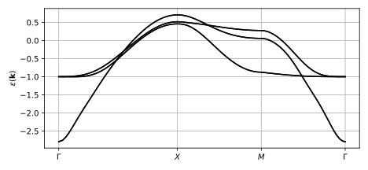
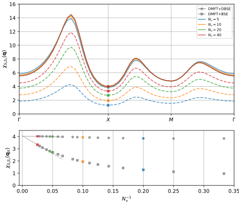

.. _dmft_susceptibility_dbse:

Spin susceptibility in Sr2RuO4
==============================

In this tutorial we will compute the static magnetic susceptibilitly :math:`\chi_{S_z S_z}(\mathbf{q})` of the correlated Hund's metal Sr2RuO4 withn dynamical mean field theory (DMFT), reproducing the results of `PRB 100, 125120 (2019) <https://doi.org/10.1103/PhysRevB.100.125120>`_. We will use the reformulation of the (DMFT) lattice susceptibility in terms of the dual Bethe-Salpeter equation (DBSE) with :math:`1/N_\nu^3` convergence with respect to the number of fermionic Matsubara frequencies :math:`N_\nu`, for details see `arXiv 2306.05157 <https://arxiv.org/abs/2306.05157>`_.

The calculation is based on a Wannier model for the three bands crossing the Fermi level in Sr2RuO4. These bands have Ru-4d t2g symmetry and a Wannier interpolation with Wannier90 converges in just a few iterations, giving the band structure

see :download:`tight_binding_model.py <tight_binding_model.py>` using the Wannier90 output :download:`sro_hr.dat <./calc_dft/wannier_fit/sro_hr.dat>`, :download:`sro.wout <./calc_dft/wannier_fit/sro.wout>`. The setup for producing these files using Quantum Espresso and Wannier90 is available in `the TPRF repository <https://github.com/TRIQS/tprf>`_ under `./doc/user_guide/dmft_susceptibility_dbse/calc_dft`.

The Wannier Hamiltonian is combined with a local Kanamori interaction with Hubbard :math:`U=2.4` eV and Hund's :math:`J=0.4` eV and the self-consistent DMFT solution is determined using TRIQS/cthyb as impurity solver. The scripts for the DMFT solution are :download:`common.py <common.py>` and :download:`calc_sc_dmft.py <calc_sc_dmft.py>`.

Dual Bethe-Salpeter equation
----------------------------

In order to use the dual Bethe-Salpeter equation for computing the lattice susceptiblity we need to sample not one but three different kinds of two-particle correlators of the DMFT impurity problem.

1. The three frequency two particle Green's function :math:`g^{(4)}_{abcd}(\omega, \nu, \nu')`
2. The two frequency two particle Green's function :math:`g^{(3)}_{abcd}(\omega, \nu)`
3. The one frequency two particle Green's function, a.k.a. the susceptiblity :math:`g^{(2)}_{abcd}(\omega) = X_{abcd}(\omega)`

Since the hybridization function of the Sr2RuO4 impurity problem is diagonal due to symmetry, it is not possible to sample all spin-orbital components :math:`abcd` of these correlators using partition function sampling Monte Carlo. Therefore we use the hybridization expansion with worm sampling as implemented in `W2Dynamics <https://github.com/w2dynamics/w2dynamics>`_ to sample these correlators, using the `TRIQS/w2dynamics_interface <https://github.com/triqs/w2dynamics_interface>`_. The example scripts for the sampling are :download:`calc_g2.py <calc_g2.py>`, :download:`calc_tri.py <calc_tri.py>`, and :download:`calc_chi.py <calc_chi.py>`.

From :math:`g^{(4)}_{abcd}(\omega, \nu, \nu')` we compute the impurity reducible vertex function :math:`F_{abcd}(\omega, \nu, \nu')` and from :math:`g^{(3)}_{abcd}(\omega, \nu)` the three point vertex function :math:`L_{abcd}(\omega, \nu)` is obtained, see `arXiv 2306.05157 <https://arxiv.org/abs/2306.05157>`_. Using the impurity susceptibility :math:`X_{abcd}(\omega)`, :math:`F`, and :math:`L` the lattice susceptibility :math:`\chi` is given by

.. math::
   \chi = X + L \frac{\tilde{\chi}^0}{1 - \tilde{\chi}^0 F} L

where :math:`\tilde{\chi}^0` is the dual bubble propagator constructed from the non-local part of the single particle Green's function. Here is an example scirpt that performs these steps starting from the sampled propagators from W2Dynamics:

.. literalinclude:: calc_dbse.py
   :lines: 23-

and also solves the traditional Bethe-Salpeter equation using the irreducible vertex :math:`\Gamma` for comparison.
	   
Solving both the dual Bethe-Salpeter equation (DBSE) and the Bethe-Salpeter equation (BSE) for a range of the Fermionic cut-off frequencies :math:`N_\nu` (the number of frequencies :math:`\nu` and :math:`\nu'` used) shows the superior convergence property of the dual Bethe-Salpeter equation

	   
see  :download:`plot_dbse.py <plot_dbse.py>` for the plot script.

Since the standard Bethe-Salpeter equation (BSE) only converges as :math:`1/N_\nu` the calculations at :math:`N_\nu = 4, 8, 16` are far from the :math:`N_\nu \rightarrow \infty` limit and requires extrapolation in order to obtain a quantiative correct result. However, using the dual Bethe-Salpeter equation (DBSE) implementation we observe a drastically improved convergence rate and already at :math:`N_\nu=4` the result is within 5% of the converged solution.

If you use the dual Bethe-Salpeter equation formulation in your work please cite `arXiv 2306.05157 <https://arxiv.org/abs/2306.05157>`_.
